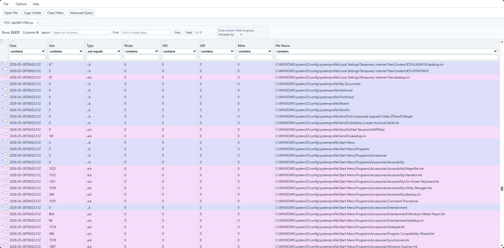

# Timeline Exploder

A lightweight, browser-based CSV/JSON/SQLite explorer for large tabular datasets. Inspired by Eric Zimmerman's Timeline Explorer.

## What It Does

- Opens local `.csv`, `.json` and `sqlite` files directly in the browser,
- Supports CSV with or without header row,
- Supports JSON as:
  - `[{...}, {...}]` (array of objects)
  - `[[...], [...]]` (array of arrays)
  - `{ "rows": [...] }`
- Renders a scrollable data grid with sticky headers and sticky selection column,
- Provides interactive analysis controls (filter/sort/group/reorder/resize),
- Virtualised rendering for larger files, for more seamless scrolling,
- Global search and find next support.

## Core Features

### File Handling

- `Open File` button and `File > Open...` menu
- Automatic parsing and normalization of CSV/JSON values
- Support for SQLite databases with multiple tables

### Filtering & Search

- **Per-column filters** in each header (applied on Enter)
- **Global search bar** in meta row (`Search`) across all columns to filter down results in the table
- **Find in visible table** in meta row (`Find`) to find instances of a string across the table
- **Advanced query bar** for complex boolean filtering

## Keyboard Shortcuts

These shortcuts are available after a dataset is loaded:

- `Cmd/Ctrl+O` Open file
- `Cmd/Ctrl+F` Show Find bar
- `F3` Next Find match
- `Shift+F3` Previous Find match
- `Alt+G` Focus Global Search
- `Alt+A` Focus/open Advanced Search
- `Alt+F` Clear all filters
- `Alt+V` Copy visible rows
- `Alt+S` Copy selected rows
- `Alt+B` Clear grouping (when grouping is active)
- `Esc` Close open overlays/menus/context menus

## Advanced Query

Use the `Advanced Search` control to apply complex filters across rows. Columns can be dragged to the query bar too, instead of typing.

### Syntax

- Boolean operators: `AND`, `OR`, `NOT`
- Parentheses for grouping: `( ... )`
- Free text term (searches all visible fields): `failed`
- Field contains: `field:value`
- Field equals: `field=value`
- Field not equals: `field!=value`
- Comparisons: `field>value`, `field>=value`, `field<value`, `field<=value`
- Regex: `/timeout|denied/i`
- Quoted field names are supported: `"User Agent":chrome`

### Examples

- `status:failed AND (user:admin OR user:root)`
- `clientcountry=ro AND score>=50`
- `NOT action:allow`
- `"Event Time">2025-01-01 00:00:00`

### Grouping / Drill Down

- Drag a column header to **Drop column here to group**
- Add multiple grouped fields by dropping more columns
- Reorder grouped fields by dragging grouped chips in the meta row
- Remove one grouped field via chip `×`
- Clear all grouped fields via grouped-area `×`
- Expand/collapse grouped sections to drill into nested levels